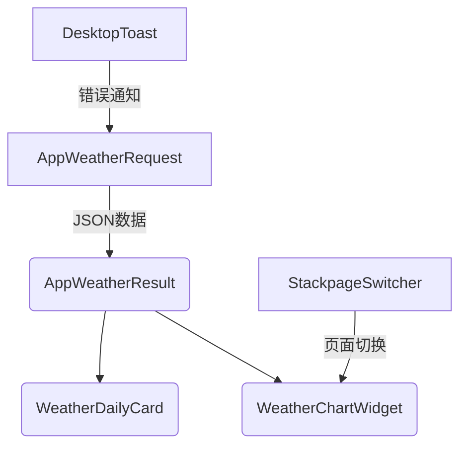

# **WeatherChartWidget**
**头文件**: `WeatherChartWidget.h`  
**继承关系**: QWidget  
**依赖**: QtCharts  
**功能**: 多维度天气数据图表展示  

#### **页面枚举**
```cpp
enum Page {
    MAIN_PAGE,    // 综合视图
    HIGH_TEMP,    // 高温趋势图
    LOW_TEMP,     // 低温趋势图  
    WINDSCALE,    // 风力等级图
    HUMIDITY      // 湿度变化图
};
```

#### **核心方法**
| 方法                  | 参数                   | 说明             |
| --------------------- | ---------------------- | ---------------- |
| `fresh_display`       | `QList<DailyWeather>&` | 刷新所有图表数据 |
| `switch_to_page`      | `const Page&`          | 切换展示维度     |
| `makeup_chart` (私有) | 数据源+lambda          | 通用图表构建方法 |

**数据绑定示例**:
```cpp
using FromDailySession = std::function<int(const DailyWeather&)>;
makeup_chart(data, "高温趋势", [](const auto& w){ 
    return w.high.split("°")[0].toInt(); 
});
```

---

### **组件协作关系**


1. **数据驱动UI**：统一使用`DailyWeather`作为数据载体
2. **动画解耦**：切换动画与业务逻辑分离
3. **响应式设计**：图表组件支持动态数据刷新
