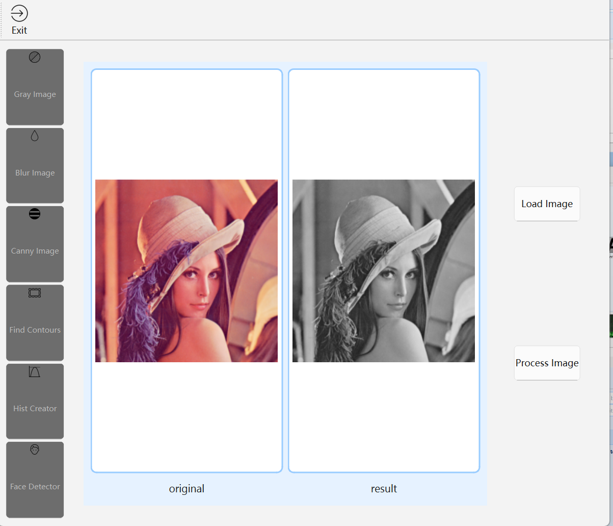
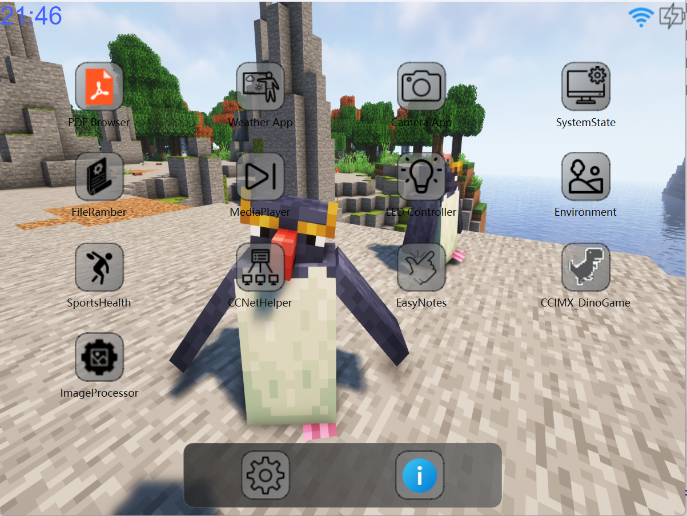
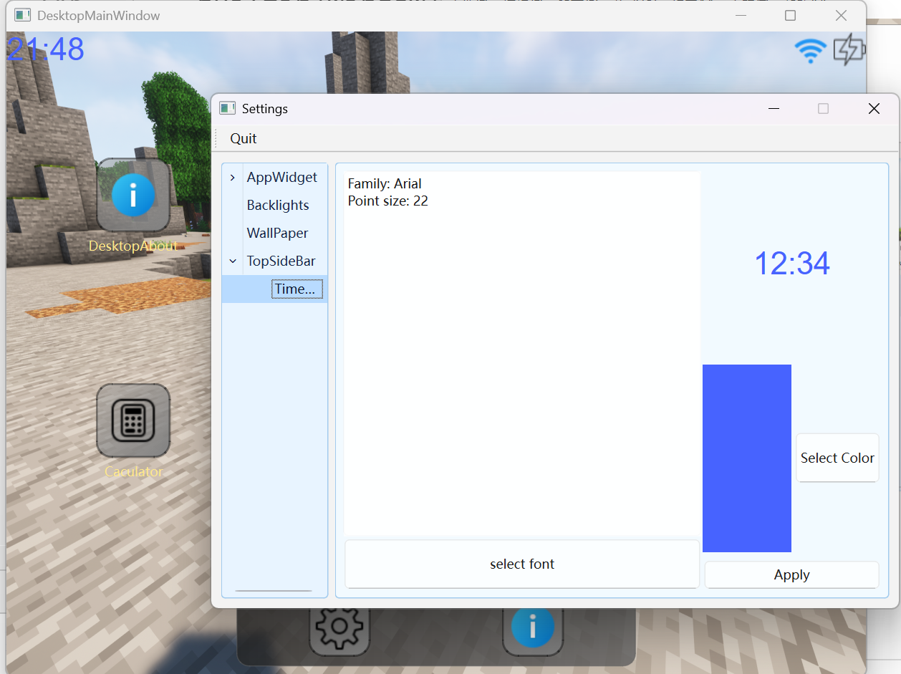

# CCIMXDESKTOP 🖥️ 

🔌 您好！这是一个可在多种嵌入式设备中使用的简单桌面和实用程序集合！这个项目目前需要使用C++23进行编译（值得一提的是，您可以使用C++17编译，但是需要少许的修改任何要求使用C++23的项目）

## 🌐 开始之前，选择你的语言！ 🌐

[🇬🇧 English Version](./README_EN.md) | [🇨🇳 中文](./README.md)

## 🌟 项目概述 🌟

**CCIMXDESKTOP** 提供了一个轻量级、可扩展的桌面环境，专为基于 NXP i.MX6ULL 平台的嵌入式系统优化。它包含一系列内置工具、设备集成层和内置的辅助应用程序，所有这些都在一个统一的用户界面中呈现。

现在，CCIMXDesktop支持的一键构建包括：

| 功能 / 应用名称                                  | 依赖条件或备注                                     | 是否为内建程序 | 说明                                                         | 界面展示                                                     |
| ------------------------------------------------ | -------------------------------------------------- | -------------- | ------------------------------------------------------------ | ------------------------------------------------------------ |
| 🏠 CCIMX_Desktop本体                              | 标准最小依赖                                       | 是             | 核心框架，本体                                               |  |
| ℹ About App                                      | 标准最小依赖                                       | 是             | 简单的介绍本项目桌面的基本情况                               |  |
| ✏️ CCNoter（记事本）                              | 标准最小依赖                                       | 是             | 超级无敌轻量的记事本                                         |  |
| 🎨 SimpleDrawer（画图）                           | 标准最小依赖                                       | 是             | 超级无敌轻量的画图，类似Windows的“画图”                      |  |
| ☀️ WeatherAPP（天气应用）                         | 需设备具备联网能力（网络连接）                     | 可选           | 获取城市所在的天气预报，目前使用的API是心智天气的            |  |
| 📄 pdfReader（PDF阅读器）                         | MuPDF依赖库                                        | 可选           | 最基础的PDF浏览器，支持章节跳转和查看功能                    |  |
| 📁 FileRamber（文件浏览器）                       | 标准最小依赖                                       | 是             | 文件管理基础（文件浏览器，具备基本的文件导览，Windows Explorer.exe的Tiny版本） |  |
| 📷 GeneralLocalCamera（摄像头）                   | 需要OpenCV支持                                     | 可选           | 可以进行拍照                                                 |  |
| 📊 SystemState（系统状态查看）                    | 标准最小依赖                                       | 是             | 查看运行机的CPU状态，内存容量状态和进程列表                  |  |
| 🎵 MediaPlayer（音视频播放器）                    | QMediaPlayer支持ALSA或其他音频，视频需要OpenCV支持 | 可选           | 网易云风格的音视频播放器，既可以播放音频也可以播放视频，音频时展示网易云风格的界面！ |  |
| 💡 LEDController App（灯控制）                    | Platform LED驱动                                   | 可选           | 需硬件支持（开关灯APP，需要 Platform LED 驱动使能）          |  |
| 🌡️ Environment App（环境监测）                    | AP3216C传感器驱动                                  | 可选           | 需硬件支持（AP3216C驱动需要被挂载且正常驱动）                |  |
| 🏃 SportHealth App（运动健康）                    | ICM20608驱动                                       | 可选           | 需硬件支持（ICM20608驱动需要被挂载且正常驱动）               |  |
| 🖼️ ImageWalker（图像浏览器）                      | 标准最小依赖                                       | 是             | 最基础的图像信息浏览查看器，相当于丐版的Windows图像浏览器    |  |
| ✏️ Markdown阅读器                                 | 标准最小依赖                                       | 是             | 轻量级Markdown编辑预览（最基础的Markdown编辑 + 预览功能，支持草稿 / 加载保存Markdown与基础快捷功能） |  |
| 🛜 CCNetHelper（网络工具）                        | 需要网卡具备网络连接能力（网卡驱动正常）           | 可选           | 支持网卡信息查看，IP端口扫描和基本测试IP打通能力             |  |
| 🦖 Dinasour Game（小游戏）                        | 标准最小依赖                                       | 可选           | 是的，就是那个Google Dinasour Game，用Qt6 Widgets实现的版本 :) |  |
| 🧮 Calculator（计算器）                           | 标准最小依赖                                       | 是             | 基础工具（标准计算器）                                       |  |
| 🤖 ImageProcessor（图像处理和推理）               | OpenCV，推理库（如有）                             | 可选           | 需OpenCV支持及推理支持                                       |  |
| ⚙ Settings（设置界面）                           | 标准最小依赖                                       | 是             | 桌面壁纸、亮度和桌面应用风格设置                             |  |
| 🚀 Dynamic Application Launcher（动态应用启动器） | 标准最小依赖                                       | 是             | 第三方应用运行和管理                                         |  |

------

## 一些运行截图

1）主界面：HOME界面（截图版本：Release1.3.0）

2）BuiltinAPP展示界面

3）ExternAPP第三方可选构建配置

4）APP设置桌面界面

## 🛠️ 基础构建所用技术

构建这个项目要求您已经完成对Qt6的移植（基础的必要移植包括TSLib做交互，QtCore QtWidget QtGui三件套，QtNetwork和最小至少支持ALSA音频播放的QtMultiMedia组件的支持），请您核查自己的构建是否足够支持构建本桌面和第三方应用程序！

提示：全量构建需要大约近10分钟（16线程），您可以根据需求动态调整，详细请参考构建文档

> [🛠️ 如何构建本项目？（支持 X86 gcc、ARM-linux-gnueabihf-gcc 和 Windows GCC）](Documentations/HOW_To_Build_The_Desktop.md)

## 🛠️ 完整构建所用技术

- OpenCV 用于摄像头支持和图像变换处理（如果您不使用OpenCV图像处理和任何对视频流的支持，可以不提供库，但是所有的相关APP会全部置为不构建！）
- MuPDF（用于 PDF 渲染）（这些用于基于 mupdf 的 PDF 阅读器，如果您不希望构建，可以不予理会MuPDF依赖，所有的相关APP会全部置为不构建！）

------

## 🧩开发者参考

- [📖 汉语模块说明](./Components-explain-CN.md)

---

## 📚项目文档

如果您对项目的制作流程和开发文档感兴趣，请参考Documentations文件夹。有关构建流程及定制，请查阅构建手册：

> [🛠️ 如何构建本项目？（支持 X86 gcc、ARM-linux-gnueabihf-gcc 和 Windows GCC）](Documentations/HOW_To_Build_The_Desktop.md)

文档已通过 GitHub Actions 自动部署，访问：[CCIMXDesktop: Main Page](https://charliechen114514.github.io/CCIMXDesktop/)

## 💡 WIP（一些正在开发的WIP Third Party App）

🚀 计划优化的桌面本体工作：

- 暂无

🚀 计划编写和提供更多的外部基础程序：

- 💬 聊天室（计划类似于QQ）
- ⏰ 闹钟APP
- 🔌 串口助手
- ✅ 任务清单

------

## 📝 许可证

本项目基于 MIT 许可证，欢迎随意移植、修改和使用！
