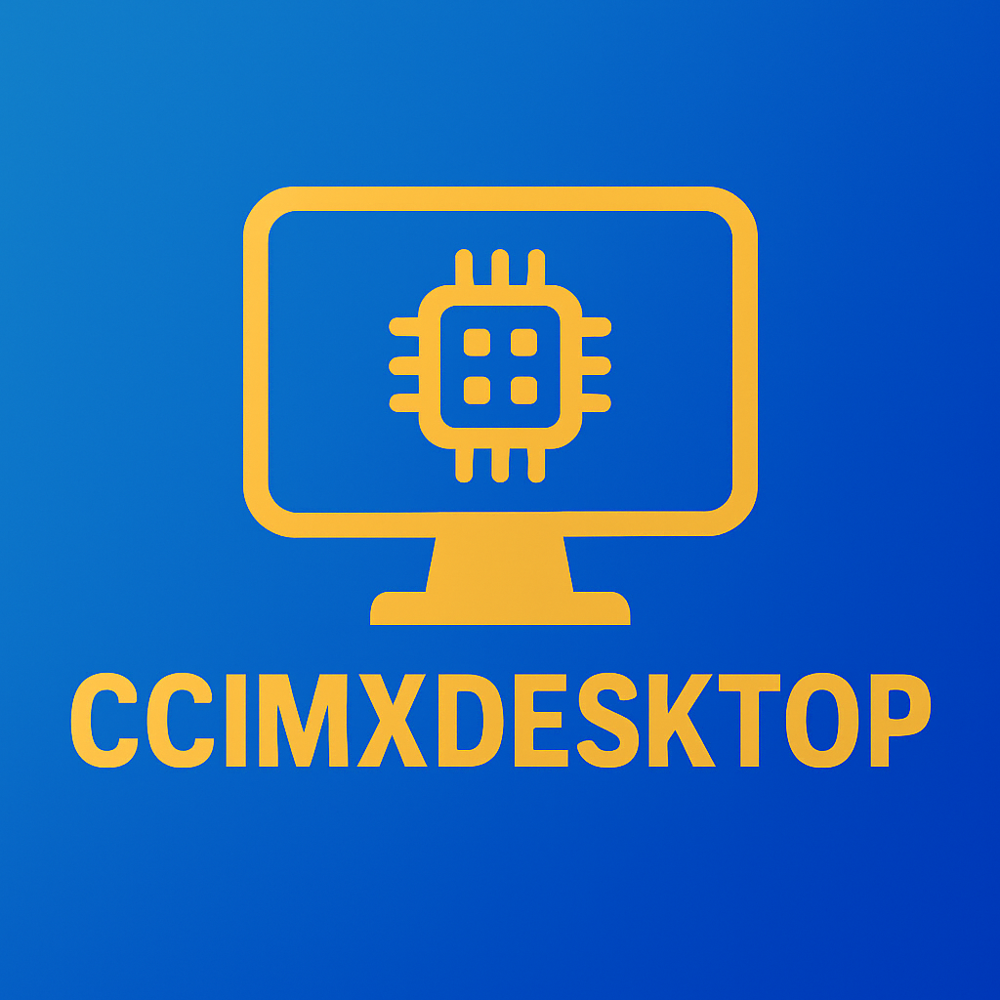
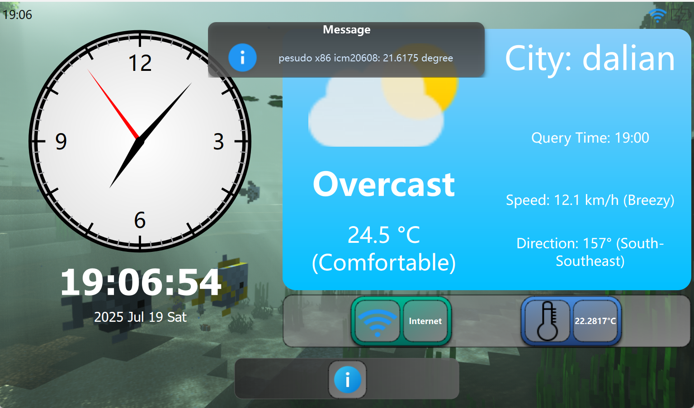
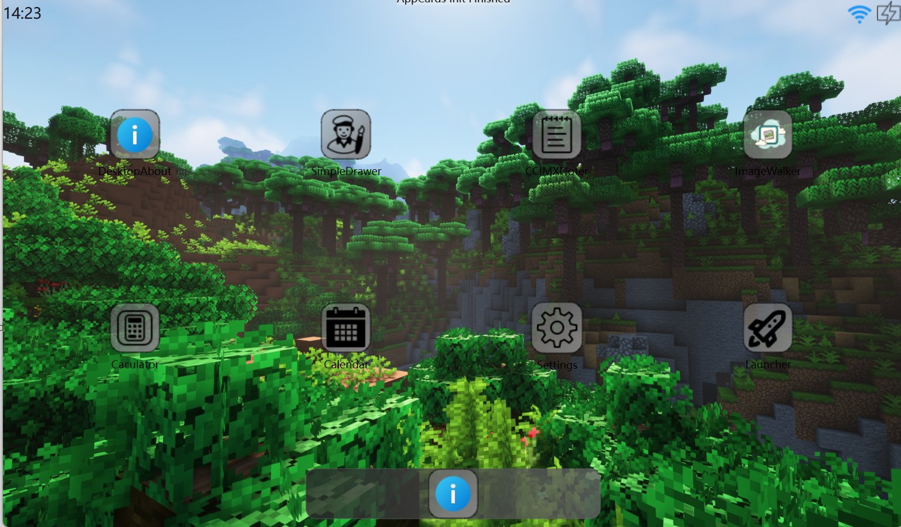
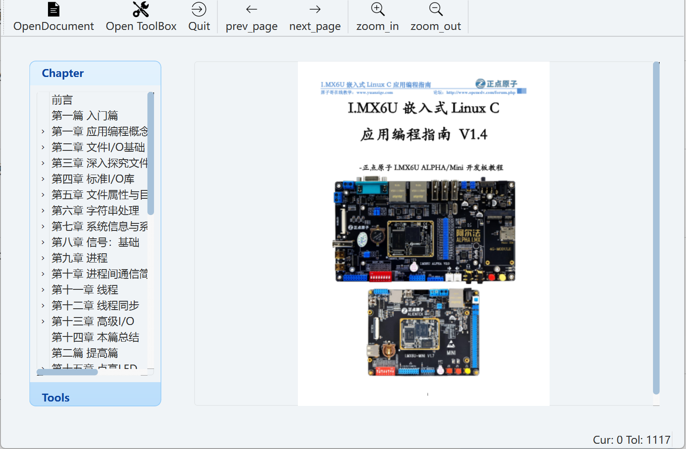

# CCIMXDESKTOP 🖥️

🔌 Hello! This is a collection of simple desktops and utilities that can be used in embedded devices with IMX6ULL LCD screens! This project can now be compiled with full C++17!

## 🌐 Before you begin, choose your language! 🌐

[🇬🇧 English Version](./README_EN.md) | [🇨🇳 Chinese](./README.md)

## 🌟 Project Overview 🌟

**CCIMXDesktop** is a minimalist, lightweight and high-performance desktop environment framework based on Qt6.8.3, specially customized for embedded systems such as NXP i.MX6ULL platform (i.e. embedded systems that cannot run heavyweight desktop services but can run Qt programs). It provides a series of common Qt built-in tool packages, device management inheritance and built-in auxiliary applications, all of which are presented in a unified user interface. Let you use embedded devices with LCD easily and visually!

The project supports running on Windows, Linux host computers and ARM-Linux with a basic environment (complete root file system + Qt + C++ runtime environment)

## Some running screenshots

0. Video Previewed (In Bilibili)

[Tiny Desktop Written for IMX6ULL](https://www.bilibili.com/video/BV1cTgnzvEtL?vd_source=7756b1d353ef340c2ab91e80642a8922)

1) Screen when starting loading (screenshot version: Release 2.0.0)

2) Main interface: HOME interface (screenshot version: Release1.15.0)

2) BuiltinAPP display interface

3) ExternAPP third-party optional build configuration

4) APP settings desktop interface

## 🛠️ Technologies used to build the foundation

Building this project requires that you have completed the porting of Qt6 (the basic necessary porting includes TSLib for interaction, QtCore QtWidget QtGui three-piece set, QtNetwork and at least QtMultiMedia component support for ALSA audio playback). Please check whether your build is sufficient to support the building of this desktop and third-party applications!

Tip: The full build takes about 10 minutes (16 threads). You can adjust it dynamically according to your needs. Please refer to the build document for details

> [🛠️ How to build this project? (Supports X86 gcc, ARM-linux-gnueabihf-gcc and Windows GCC)](Documentations/HOW_To_Build_The_Desktop.md)

## 🛠️ Full build of technologies

- OpenCV for camera support and image transform processing (if you don't use OpenCV image processing and any support for video streaming, you can leave out the library, but all related apps will be set to not build!)

- MuPDF (for PDF rendering) (These are used for the mupdf-based PDF reader. If you don't want to build, you can ignore the MuPDF dependency and all related apps will be set to not build!)

------

## What's here?

Now, CCIMXDesktop supports one-click building including:
(Note: the standard minimum dependencies are: TSLib for interaction 📝, QtCore 🔧 QtWidget 🖼️ QtGui 🎨 QtNetwork 🌐 basic support for the four-piece set)

#### Desktop main body function 💻

- 📦 Basic application host + dynamic APP launch⚡
- 🖼️ Wallpaper animation, hosting function🌀

- 🛠️ Basic built-in auxiliary APP (cannot be uninstalled🔒)

- 📜 Log management system, add a log system to CCIMXDesktop to facilitate debugging🔍 and observation👀

- 📂 Initially stable desktop private folder system

- ℹ Initially built service system (message notification system)

- 🔌 Initially built Widget plug-in system (currently only HOME card group can be plug-inized)

- 👨 The most basic user information system

- 🗃️ Silky sliding card system ✨

Currently registered built-in card types 📦:

- 📅 Calendar card
- 🗓️ Date card
- 💾 Hard storage information system
- 💾 Memory information system
- 👨Default user information card display

#### Project includes

| Function / Application Name | Dependency Conditions or Remarks | Is it a built-in program | Description | Interface Display |
| ------------------------------------------------ | -------------------------------------------------- | -------------- | ------------------------------------------------------------ | ------------------------------------------------------------ |
| 🠠CCIMX_Desktop Body | Standard Minimum Dependency | Yes | Core Framework, Body |  |
| ℹ About App | Standard Minimum Dependency | Yes | Briefly introduce the basic situation of the desktop of this project |  |
| ✏️ CCNoter (Notepad) | Standard minimum dependencies | Yes | Super lightweight notepad |  |
| 📅CCCalendar (Calendar APP) | Standard minimum dependencies | Yes | Super lightweight calendar APP |  |
| 🨠SimpleDrawer (Drawing) | Standard minimum dependencies | Yes | Super lightweight drawing, similar to Windows' "Paint" |  |
| ☀️ WeatherAPP (weather application) | The device needs to have Internet access (network connection) | Optional | Get the weather forecast for the city. The API currently used is Mind Weather's |  |
| 📄 pdfReader (PDF reader) | MuPDF dependency library | Optional | The most basic PDF browser, supporting chapter jump and viewing functions |  |
| 📠FileRamber (file browser) | Standard minimum dependency | Yes | File management basics (file browser, with basic file navigation, Tiny version of Windows Explorer.exe) |  |
| 📷 GeneralLocalCamera (camera) | OpenCV support required | Optional | Can take pictures |  |
| 📊 SystemState (system status view) | Standard minimum dependency | Yes | View the CPU status, memory capacity status and process list of the running machine |  |
| 🵠MediaPlayer (audio and video player) | QMediaPlayer supports ALSA or other audio, and video requires OpenCV support | Optional | NetEase Cloud style audio and video player, which can play both audio and video, and displays the NetEase Cloud style interface when playing audio! |  |
| 💡 LEDController App (light control) | Platform LED driver | Optional | Hardware support required (light switch APP, Platform LED driver needs to be enabled) |  |
| 🌡️ Environment App (environmental monitoring) | AP3216C sensor driver | Optional | Hardware support required (AP3216C driver needs to be mounted and driven normally) |  |
| 🃠SportHealth App (Sports Health) | ICM20608 driver | Optional | Hardware support required (ICM20608 driver needs to be mounted and driven normally) |  |
| 🖼️ ImageWalker (Image Browser) | Standard minimum dependency | Yes | The most basic image information browser, equivalent to the Windows image browser for the poor version |  |
| ✏️ Markdown Reader | Standard minimum dependency | Yes | Lightweight Markdown editing and preview (the most basic Markdown editing + preview function, supporting drafts / Load and save Markdown and basic shortcut functions) |  |
| 🛜 CCNetHelper (network tool) | Requires the network card to have network connection capability (network card driver is normal) | Optional | Supports network card information viewing, IP port scanning and basic test IP connection capability |  |
| 🦖 Dinasour Game (mini game) | Standard minimum dependency | Optional | Yes, it is the Google Dinasour Game, the version implemented with Qt6 Widgets :) |  |
| 🧮 Calculator (Calculator) | Standard minimum dependencies | Yes | Basic tools (standard calculator) |  |
| 🤖 ImageProcessor (Image processing and reasoning) | OpenCV, reasoning library (if any) | Optional | OpenCV support and reasoning support are required |  |
| ⚙ Settings (Settings interface) | Standard minimum dependencies | Yes | Desktop wallpaper, brightness and desktop application style settings |  |
| 🚀 Dynamic Application Launcher | Standard minimum dependencies | Yes | Third-party application operation and management |  |

------

## 🧩 Developer Reference

- [📖 Chinese Module Description](./Components-explain-CN.md)

---

## 📚Project Documentation

If you are interested in the project production process and development documents, please refer to the Documentations folder. For the build process and customization, please refer to the build manual:

> [🛠️ How to build this project? (Supports X86 gcc, ARM-linux-gnueabihf-gcc and Windows GCC)](Documentations/HOW_To_Build_The_Desktop.md)

The document has been automatically deployed via GitHub Actions, visit: [CCIMXDesktop: Main Page](https://charliechen114514.github.io/CCIMXDesktop/)

## 💡 WIP and Plans

### 🚀 Planned optimization of the desktop body:

- Added a quick setting channel for the drop-down menu (brightness adjustment, etc.)
- Added a desktop refresh function for buttons (wait for the next version to update the button driver, press the button to force return to the HOME interface)
- Developed a **to-do/reminder application** that is deeply integrated with the desktop. Supports displaying upcoming reminders in the status bar and important reminders on the lock screen. (The plug-in system already supports)
- Enhanced the automatic reduction of brightness after a long period of no response and the brightness enhancement setting when clicking
- Plan to add lock screen

### 🚀 Plan to write and provide more external basic programs:

- 💬 Chat room (planned to be similar to QQ)

- ⏰ Alarm clock APP
- 🔌 Serial port assistant
- ✅ Task list

### 🚀 Document plan

- Further and more clearly improve the design document part of the project, and expand the relevant document auxiliary instructions for the gradual configuration of the desktop

------

## 📝 License

This project is based on the MIT license, and you are welcome to transplant, modify and use it at will!
