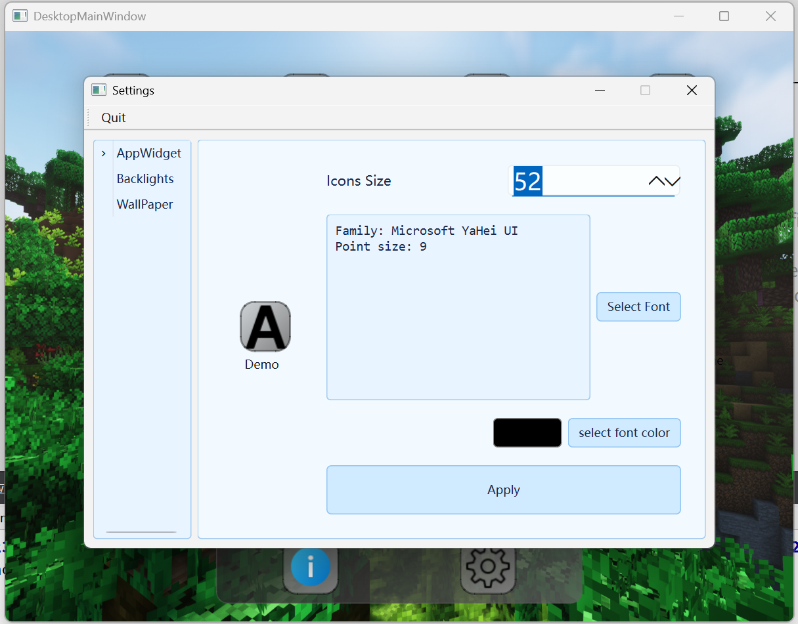

# CCIMXDESKTOP 🖥️

🔌 Hello! This is a simple desktop and utility collection that can be used in a variety of embedded devices! This project currently requires C++23 to compile (it's worth noting that you can compile with C++17, but any projects that require C++23 will need minor modifications)

## 🌐 Before you get started, choose your language! 🌐

[🇬🇧 English Version](./README_EN.md) | [🇨🇳 Chinese](./README.md)

## 🌟 Project Overview 🌟

**CCIMXDESKTOP** provides a lightweight, extensible desktop environment optimized for embedded systems based on the NXP i.MX6ULL platform. It includes a range of built-in tools, device integration layers, and built-in helper applications, all presented in a unified user interface.

Now, CCIMXDesktop supports one-click builds including:

| Function / Application Name | Dependency or Remarks | Is it a built-in program | Description | Interface Display |
| ------------------------------------------------ | -------------------------------------------------- | -------------- | ------------------------------------------------------------ | ------------------------------------------------------------ |
| 🠠CCIMX_Desktop Ontology | Standard Minimum Dependency | Yes | Core Framework, Ontology |  |
| ℹ About App | Standard minimum dependencies | Yes | A brief introduction to the basic situation of the desktop of this project |  |
| ✏️ CCNoter (Notepad) | Standard minimum dependencies | Yes | Super lightweight notepad |  |
| 🨠SimpleDrawer (Painting) | Standard minimum dependencies | Yes | Super lightweight drawing, similar to Windows' "Paint" |  |
| ☀️ WeatherAPP (weather application) | The device needs to have Internet access (network connection) | Optional | Get the weather forecast for the city. The API currently used is Mind Weather's |  |
| 📄 pdfReader (PDF reader) | MuPDF dependency library | Optional | The most basic PDF browser, supporting chapter jump and viewing functions |  |
| 📠FileRamber (file browser) | Standard minimum dependency | Yes | File management basics (file browser, with basic file navigation, Tiny version of Windows Explorer.exe) |  |
| 📷 GeneralLocalCamera (camera) | Requires OpenCV support | Optional | Can take pictures |  |
| 📊 SystemState (system status view) | Standard minimum dependency | Yes | View the CPU status, memory capacity status and process list of the running machine |  |
| 🵠MediaPlayer (audio and video player) | QMediaPlayer supports ALSA or other audio, and video requires OpenCV support | Optional | NetEase Cloud style audio and video player, which can play both audio and video, and displays the NetEase Cloud style interface when playing audio! |  |
| 💡 LEDController App (light control) | Platform LED driver | Optional | Hardware support required (light switch APP, Platform LED driver needs to be enabled) |  |
| 🌡️ Environment App (environmental monitoring) | AP3216C sensor driver | Optional | Hardware support required (AP3216C driver needs to be mounted and driven normally) |  |
| 🃠SportHealth App (Sports Health) | ICM20608 driver | Optional | Hardware support required (ICM20608 driver needs to be mounted and driven normally) |  |
| 🖼️ ImageWalker (Image Browser) | Standard minimum dependency | Yes | The most basic image information browser, equivalent to the Windows image browser for the poor version |  |
| ✏️ Markdown Reader | Standard minimum dependency | Yes | Lightweight Markdown editing and preview (the most basic Markdown editing + preview function, supporting drafts / Load and save Markdown and basic shortcut functions) |  |
| 🛜 CCNetHelper (network tool) | Requires the network card to have network connection capabilities (network card driver is normal) | Optional | Supports network card information viewing, IP port scanning and basic test IP connection capabilities |  |
| 🦖 Dinasour Game (mini game) | Standard minimum dependencies| Optional | Yes, that Google Dinasour Game, implemented with Qt6 Widgets :) |  |
| 🧮 Calculator (Calculator) | Standard minimum dependency | Yes | Basic tools (standard calculator) |  |
| 🤖 ImageProcessor (Image processing and reasoning) | OpenCV, reasoning library (if any) | Optional | OpenCV support and reasoning support required |  |
| ⚙ Settings (settings interface) | Standard minimum dependencies | Yes | Desktop wallpaper, brightness and desktop application style settings |  |
| 🚀 Dynamic Application Launcher (dynamic application launcher) | Standard minimum dependencies | Yes | Third-party application operation and management |  |

------

## Some running screenshots

1) Main interface: HOME interface (screenshot version: Release1.3.0)

2) BuiltinAPP display interface

3) ExternAPP third-party optional build configuration

4) APP settings desktop interface

## 🛠️ Technologies used to build the foundation

Building this project requires that you have completed the porting of Qt6 (the basic necessary porting includes TSLib for interaction, QtCore QtWidget QtGui three-piece set, QtNetwork and at least QtMultiMedia component support for ALSA audio playback). Please check whether your build is sufficient to support the building of this desktop and third-party applications!

Tip: The full build takes about 10 minutes (16 threads). You can adjust it dynamically according to your needs. Please refer to the build document for details

> [🛠️ How to build this project? (Supports X86 gcc, ARM-linux-gnueabihf-gcc and Windows GCC)](Documentations/HOW_To_Build_The_Desktop.md)

## 🛠️ Full build of technologies

- OpenCV for camera support and image transform processing (if you don't use OpenCV image processing and any support for video streaming, you can leave out the library, but all related apps will be set to not build!)

- MuPDF (for PDF rendering) (These are used for PDF readers based on mupdf. If you don't want to build, you can ignore MuPDF dependencies and all related apps will be set to not build!)

------

## 🧩 Developer Reference

- [📖 Chinese Module Explanation](./Components-explain-CN.md)

---

## 📚 Project Documentation

If you are interested in the project production process and development documents, please refer to the Documentations folder. For the build process and customization, please refer to the build manual:

> [🛠️ How to build this project? (Supports X86 gcc, ARM-linux-gnueabihf-gcc and Windows GCC)](Documentations/HOW_To_Build_The_Desktop.md)

The document has been automatically deployed through GitHub Actions, visit: [CCIMXDesktop: Main Page](https://charliechen114514.github.io/CCIMXDesktop/)

## 💡 WIP (some WIP Third Party Apps under development)

🚀 Plan to optimize the desktop body work:

- None

🚀 Plan to write and provide more external basic programs:

- 💬 Chat room (planned to be similar to QQ)

- ⏰ Alarm clock APP
- 🔌 Serial port assistant
- ✅ Task list

------

## 📝 License

This project is based on the MIT license, and you are welcome to port, modify and use it at will!