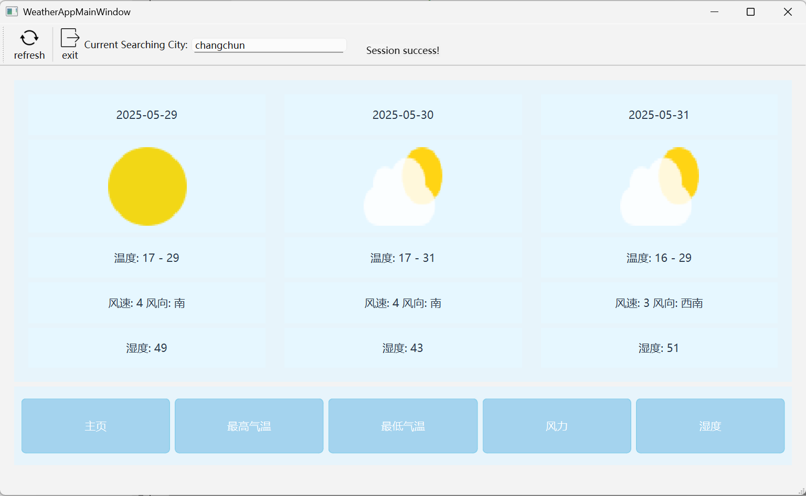

# README

✨ 一键获取最新天气，轻松切换城市✨

## 功能亮点

🔄 **实时天气更新**
 你只需要打开应用或点击刷新按钮，立刻获取最新的天气信息，出门前先知晓！

🌍 **城市自由切换**
 输入你想查询的城市，随时随地查看各地的天气状况，轻松切换，想看就看。

⚠️ **错误友好提示**
 网络请求异常？没关系，应用会优雅提示错误信息，让你清晰知道哪里出错！

📦 **自动数据解析**
 查询成功后，应用自动解析并展示温度、天气等详细信息，让数据看起来更直观。

## 快速使用

1️⃣  启动应用后，默认城市为 **changchun**（长春），自动获取该城市的天气。
 2️⃣  在输入框内输入其他城市名称，点击切换，马上获取新城市的天气信息。
 3️⃣  任何时候，点击刷新按钮即可重新获取当前城市的最新天气。
 4️⃣  遇到网络问题或查询失败，应用会弹出桌面提示，告知具体错误信息。

## 技术支持

本模块基于 **Qt** 框架开发，使用 **QNetworkReply** 发起请求并处理网络响应。模块已内置界面更新和错误处理逻辑，轻松集成到你的桌面应用中。

## 构建手册与支持说明

​	为了保证项目的轻量化，笔者采用的是心智天气的API文档接口，如果您是使用其他的相同请求格式的天气预报API，您只需要更换CMakeLists.txt中的`_DEF_WEATHER_URL`的定义后重新构建即可（抱歉，目前无法支持热更新请求接口），如果甚至连数据格式都不一致，您需要自行添加自己的派生类WeatherResult和WeatherRequest，书写具体的请求组合接口compose_request（可以参考笔者的实现）添加请求的参数和parseJsonString决定如何解析JsonString。

​	注意，如果您跟我使用的是一致的Key，您需要更换成您自己的！这个Key只是样例Key！