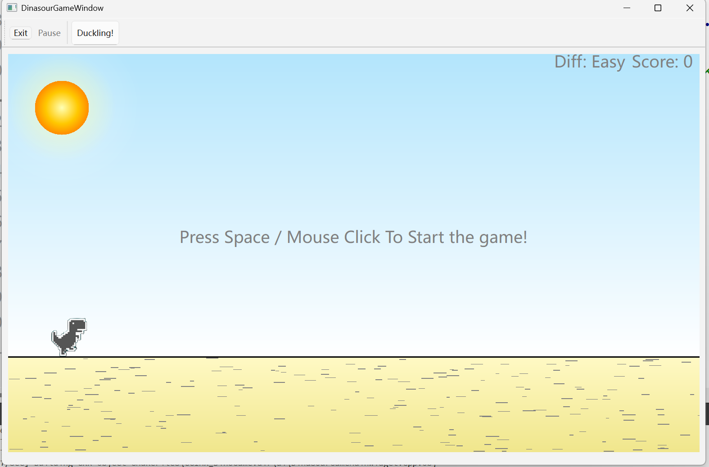
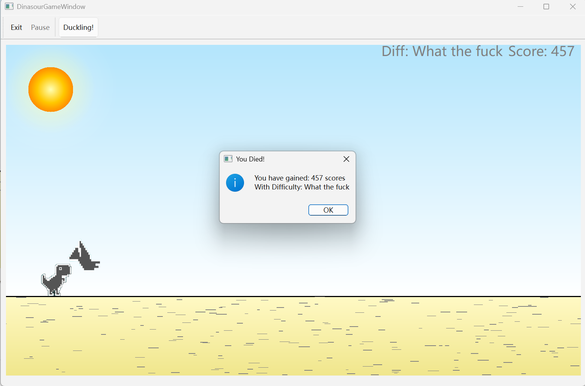

# 🦖 Qt Dino：复刻 Google 恐龙游戏

一款基于 Qt 6 和 C++ 的复古风格恐龙跳跃游戏，完美还原 Google Chrome 离线小游戏，支持动态障碍物生成、平滑动画过渡和音效增强。

------

## 🎮 游戏特色

- **经典游戏机制**：玩家控制恐龙跳跃，躲避从右侧随机出现的障碍物，如鸟类和仙人掌。
- **多样化障碍物**：游戏中包含多种大小各异的鸟和仙人掌等障碍物，增加游戏的多样性和挑战性。
- **分级激励机制**：随着游戏进程，障碍物的出现频率和速度逐渐增加，玩家需要不断提升反应速度以应对更高难度。
- **集中配置管理**：所有主要配置文件（如障碍物类型、速度、音效等）均集中在 `settings` 文件夹中，方便统一管理和调整。

------

## 🛠️ 技术栈

- **Qt 6**：跨平台应用开发框架
- **C++**：面向对象编程语言
- **QPixmap**：图像加载与显示
- **QSoundEffect**：音效播放
- **QPropertyAnimation**：属性动画实现平滑过渡

------

## 🚀 快速开始

### 克隆仓库

```bash
git clone https://github.com/Charliechen114514/CCDinoGame.git
cd CCDinoGame
```

### 构建项目

本项目需要有QMultiMedia的支持，不过，您也可以去掉项目的SoundEffectPlayer模块获得只需要最基础轻量的QtBase的支持便可以运行的Dinasore Game，使用 `CMakeLists.txt`进行配置，然后构建并运行项目。

------

## 📸 游戏截图






------

## 🧩 配置说明

所有主要配置文件位于 `settings` 文件夹中，在本版本中，您需要静态的进行修改

------

## 📄 许可证

本项目采用 MIT 许可证，详情请参阅 [LICENSE](https://chatgpt.com/c/LICENSE) 文件。

## Notes

本项目同时是一个独立项目，为了保证独立性，这里的分支版本只更新必要的bug更新，所有的最新的单独分支维护在：[Charliechen114514/CCDinoGame: CCDinoGame is a retro-style dinosaur jumping game based on Qt 6 and C++. It restores the Google Chrome offline game and supports multiple obstacles, hierarchical incentive mechanism and centralized configuration management.](https://github.com/Charliechen114514/CCDinoGame)
