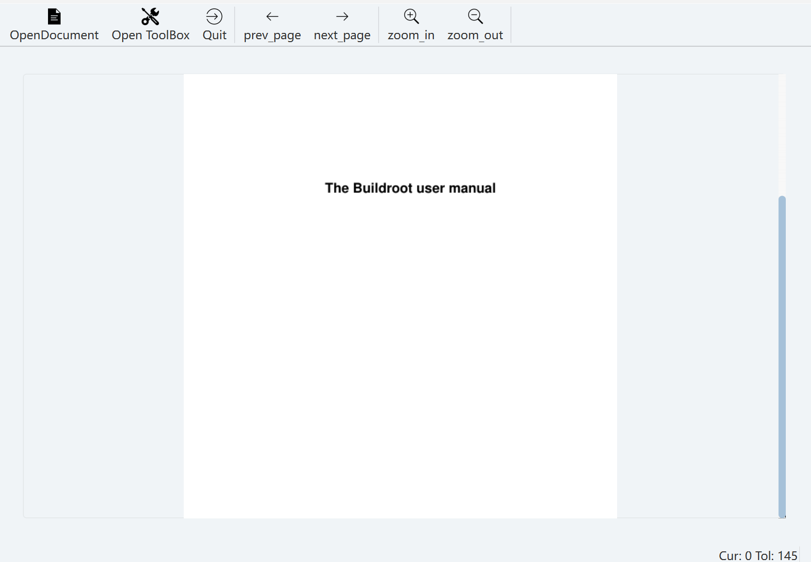

# CCIMX Desktop 工程文档（PDF阅读器）

- 项目地址：总项目[Charliechen114514/CCIMXDesktop: This is a Qt Written Desktop with base GUI Utilities](https://github.com/Charliechen114514/CCIMXDesktop)
- 本子项目地址：[CCIMXDesktop/extern_app/pdfReader at main · Charliechen114514/CCIMXDesktop](https://github.com/Charliechen114514/CCIMXDesktop/tree/main/extern_app/pdfReader)

​	子项目跟总项目无耦合关系，你可以直接拿取项目对CMakeLists进行修改，项目整体遵守MIT开源协议，因此，请随意。

​	首先简单介绍一下这个子项目，本子项目是为了让IMX6ULL的开发板具备阅读PDF的能力的项目。基本上，这里的工程路径在现在您所看到的基本构成是——

```
├───mupdf_adapter
├───mupdf_tools
├───sources
├───ui
└───ui_tools
```

​	说明一下这里的结构。

​	mupdf_adapter是笔者自己做的跟Qt6一块的桥接器，目前主要包含的是三个部分的设计

- PDF浏览控件ccpdfviewer，完全的负责了绘制MuPDF提供的图像资源。
- PDF文档句柄ccpdfdocument，完全的负责和掌管了PDF的内存特性
- PDF的文档章节解析ccpdfchaptercreator，完全的掌管了PDF的章节解析

​	mupdf_tools是驱动MuPDF真正做事情的地方，换而言之，mupdf_adapter将请求转发给了mupdf_tools下的所有的静态工具类，他们负责跟MuPDF底层的函数进行沟通，对于大部分想要了解如何封装MuPDF的朋友，这里是重点关心的地方。

​	sources只是一些Ui固化的资源文件，需要替换图标的朋友自行打开QtCreator自己修改即可

​	ui_tools则是一些Ui辅助的类，实际上包含的滑动SliderWidget等只是封装了一些传递信息的操作，这里笔者不再赘述，详细的讲解文章请到笔者的[Charliechen114514/CCQtArchives: This Repo is using in Storing the Tutorial Of Some QtWidgets And QML, with portable libraries, common Applications and so on](https://github.com/Charliechen114514/CCQtArchives)的Portable Modules部分单独拿取，那里会更新最新的控件，和修复一部分潜在的bugs

​	ui就是整体demo的一个设计文件了，这里是您所看到的整体样貌的代码实现，为此，修改上层的显示逻辑在这里做修改！

​	具体的设计在总项目的Documentations处笔者有介绍。一些相应的技术要点笔者也会放在那里进行讲解。

